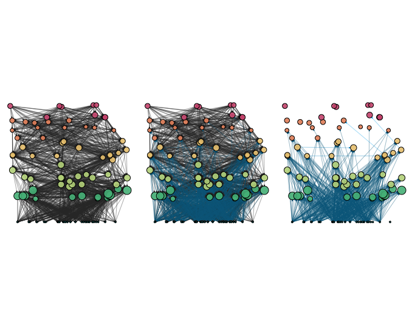

<br />

### A satellite symposium at [NetSci 2023](https://netsci2023.wixsite.com/netsci2023)

**10-14 July 2023, Vienna**

<br />

While networks have been fundamental to our understanding of the structure, function, and dynamics of socio-ecological systems, they typically include a single interaction type at a time (e.g., facilitation or competition; Dunne et al. 2002, Bascompte et al. 2003). Nevertheless, in reality, agents (such as species or people) are clearly connected by a myriad of interaction types simultaneously (Ings et al. 2009, Kéfi et al. 2012; Pilosof et al. 2017). Advances in the theory of ‘multilayer’ networks (Boccaletti et al. 2014, Kivelä, M. et al. 2014) provided a promising approach to incorporate multiple interaction types in our descriptions of ecological networks (leading to multiplex networks). One particular application is that of socio-ecological systems, in which layers represent social (e.g., fishermen, policy makers) and ecological (e.g., food webs) systems. Nevertheless, to date ecological and socio-ecological multiplex networks have been understudied. Therefore, we lack an understanding of how multiple social and ecological interaction types affect the dynamics and stability of ecological systems. Developing this theory is crucial in the anthropocene because multiplex structures affect the response of ecological systems to anthropogenic perturbations. 

The goal of our proposed Satellite Symposium is to showcase recent progress made in the study of multiplex ecological and socio-ecological networks and to discuss how these novel approaches can contribute to improving our current understanding of socio-ecological systems.


<br />

### Applications for contributed talks:

We welcome applications for contributed talks. Please send both the organizers an email (see below) with a **single PDF** including your name, affiliation and an asbtract of your talk (max 200 words) by **17 April 2023**. 


<br />

### Organizers:

Sonia Kéfi, CNRS, Montpellier, France; sonia.kefi@umontpellier.fr 

Shai Pilosof, Ben-Gurion University of the Negev, Israel; pilos@bgu.ac.il


```{r, echo=FALSE, out.width='50%', fig.align='center', fig.cap='...'}

```
  
  
**References**

Bascompte, J., Jordano, P., Melián, C. J. & Olesen, J. M. The nested assembly of plant–animal mutualistic networks. PNAS 100, 9383–9387 (2003).

Boccaletti, S. et al. The structure and dynamics of multilayer networks. Physics Reports 544, 1–122 (2014).

Dunne, J. A., Williams, R. J. & Martinez, N. D. Network structure and biodiversity loss in food webs: robustness increases with connectance. Ecology Letters 5, 558–567 (2002).

Ings, T. C. et al. Ecological networks--beyond food webs. J Anim Ecol 78, 253–269 (2009).

Kéfi, S. et al. More than a meal… integrating non-feeding interactions into food webs. Ecol. Lett. (2012) doi:10.1111/j.1461-0248.2011.01732.x.

Kivelä, M. et al. Multilayer networks. jcomplexnetw cnu016 (2014) doi:10.1093/comnet/cnu016.

Pilosof, S., Porter M.A., Pascual M., Kéfi S. 2017. The multilayer nature of ecological networks. Nature in Ecology and Evolution. 1: 0101
 


